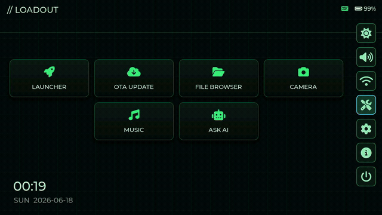
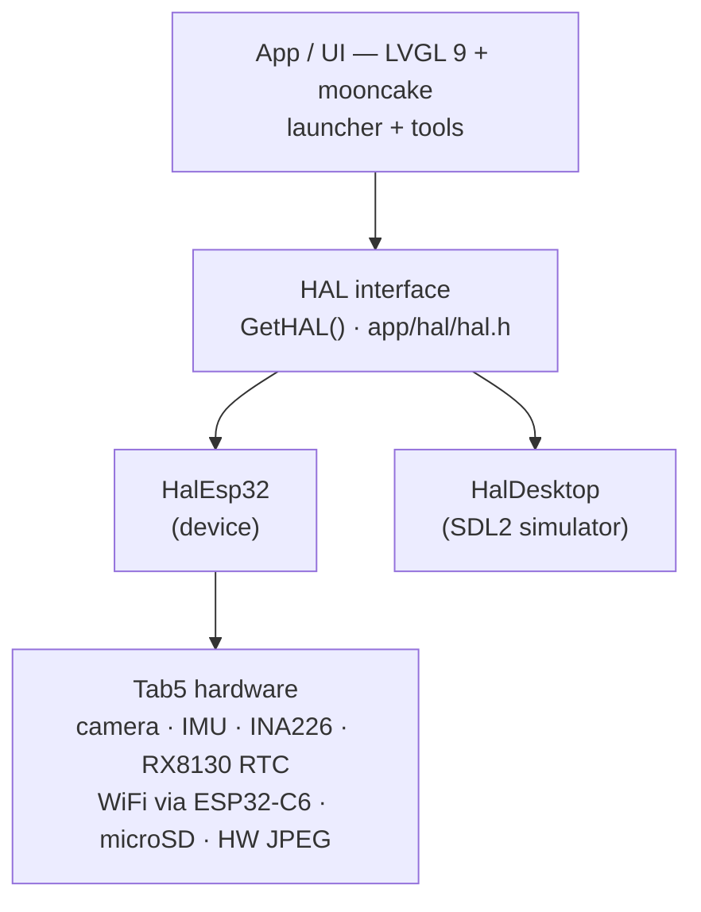
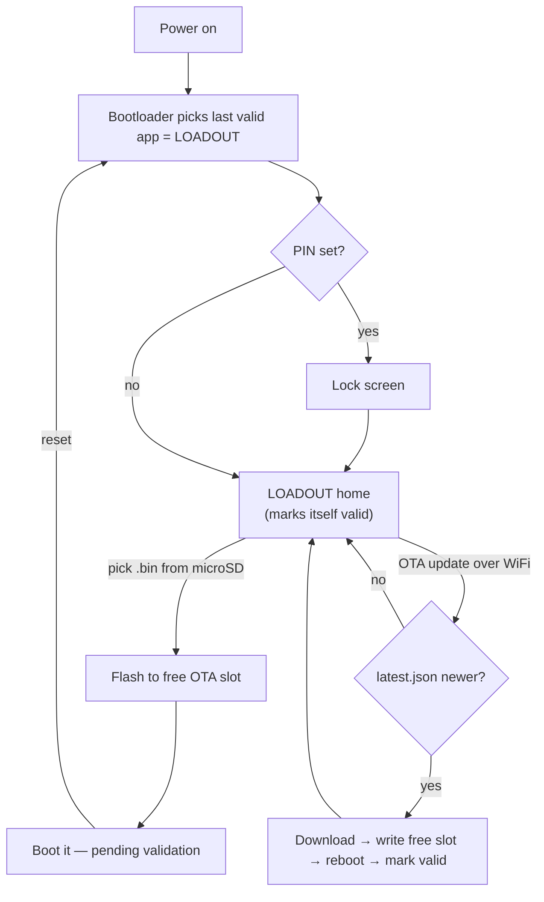

# LOADOUT

A firmware launcher and hardware toolbox for the **M5Stack Tab5** (ESP32-P4). LOADOUT
lists firmware images from the microSD and boots them, updates itself over the air from
GitHub Releases, and exposes the Tab5 hardware (camera, IMU, GPIO, I2C, UART, power,
audio) as a set of on-device tools.

<p align="center">
  
</p>

It is a fork of the official
[M5Tab5-UserDemo](https://github.com/m5stack/M5Tab5-UserDemo), rebuilt around a launcher
home screen, a real-widget UI (LVGL 9 + smooth_ui_toolkit), a HAL abstraction with a
desktop simulator, and an OTA-capable partition layout.

## How it works

Architecture (HAL abstraction with a desktop simulator):



Boot, firmware launch and OTA (A/B slots with rollback, so a bad image never bricks the
device):



## Install

The easiest way is the browser-based flasher (Chrome or Edge on desktop, nothing to
install):

**https://0day1day.github.io/loadout-tab5/**

Connect the Tab5 over USB-C, click "Connect & Flash LOADOUT", pick the serial port, and
confirm. A full erase and install is performed.

Command-line alternative (esptool): download `loadout-tab5-factory.bin` from the
[latest release](https://github.com/0day1day/loadout-tab5/releases/latest) and run:

```bash
esptool --chip esp32p4 write_flash 0x0 loadout-tab5-factory.bin
```

Release assets:

- `loadout-tab5-factory.bin` — full image for a clean flash at offset `0x0`.
- `loadout-tab5.bin` — app-only image, used by the on-device OTA updater.
- `latest.json` — OTA manifest; set its URL as `ota_url` in `loadout.conf`.

To build from source instead, see [Building](#building).

## Purpose

The Tab5 is a capable ESP32-P4 device (1280x720 touch, 32 MB PSRAM, camera, IMU, RTC,
WiFi via an ESP32-C6 co-processor). LOADOUT turns it into:

- A **firmware launcher**: drop `.bin` files on the microSD, pick one, and it flashes and
  boots. A failed or alternate firmware rolls back to LOADOUT on the next reset, so the
  device is never bricked by a bad image.
- A **self-updating app**: LOADOUT checks a GitHub Release manifest over HTTPS and updates
  itself (A/B OTA partitions with rollback).
- A **hardware toolbox**: quick access to the camera, motion sensor, GPIO, I2C scanner,
  UART monitor, power monitor, audio, and a file browser, all from one UI.

## Target hardware

- **M5Stack Tab5** — ESP32-P4 (RISC-V), 1280x720 MIPI-DSI touch panel, 32 MB PSRAM,
  16 MB flash.
- WiFi is provided by an on-board **ESP32-C6** co-processor over SDIO (ESP-Hosted).
- Display/panel/touch driven through the official `m5stack_tab5` BSP.

A second target (M5Cardputer, ESP32-S3) is on the roadmap; the launcher core and panels
are kept UI-agnostic to ease that port.

## Features

- **Launcher / firmware flashing** — lists `.bin` files from the microSD; boots a selected
  image to an OTA slot. Remembers the last flashed firmware.
- **OTA update** — checks a `latest.json` manifest on a GitHub Release over HTTPS (with the
  certificate bundle), shows progress, writes to the free OTA slot, reboots, and marks the
  new image valid. Rollback to LOADOUT if an image is not confirmed.
- **File browser + text editor** — navigate folders, copy/cut/paste/rename/delete, and edit
  text files (`.txt/.cfg/.ini/.json/.log/.md/.csv/.conf`) with the keyboard.
- **Camera** — live preview from the SC2356 sensor (V4L2-style `esp_video` pipeline).
- **IMU / Motion** — crosshair + ball visualization driven by the accelerometer.
- **GPIO test**, **I2C scanner** (internal and external buses), **UART monitor**.
- **Power monitor** — bus voltage / current / power via INA226, plus CPU temperature.
- **Music player** — MP3 playback from the microSD with an animated equalizer.
- **AI chatbot** — OpenAI-compatible chat endpoint (DeepSeek/Qwen/OpenAI/Groq/Ollama),
  multi-turn, configured from the SD config file.
- **Screen recorder** — captures the framebuffer, encodes JPEG with the ESP32-P4 hardware
  encoder, and writes a frame sequence to `/sd/rec/`. Convert to GIF/MP4 on a PC with
  `tools/frames2gif.sh`.
- **WiFi AP + STA** — hosts an access point and connects to a home network. A web dashboard
  (battery, voltage/current, brightness/volume sliders, reboot) is served on the AP.
- **PIN lock screen** — optional boot lock with an on-screen numeric keypad and physical
  keyboard support. See "Security".
- **Themes** — multiple runtime color themes (applied live, persisted in NVS), with an
  optional animated background.
- **Physical keyboard** — full navigation and text entry with the Tab5 keyboard.
- **RTC clock** — persistent real-time clock (RX8130), settable from the UI, optional NTP
  sync.

## Architecture

- **UI**: LVGL 9 with `mooncake` (app framework) and `smooth_ui_toolkit` (animated C++
  widget wrappers / modal windows). FontAwesome icons are embedded.
- **HAL abstraction**: all hardware access goes through `GetHAL()` (see `app/hal/hal.h`).
  `HalEsp32` implements it on device; `HalDesktop` provides a desktop stub. This allows the
  same app/UI code to run on hardware and in the simulator.
- **Desktop simulator (SDL2)**: build and iterate the UI on a Mac/Linux host without
  flashing.
- **Partitions / OTA**: two OTA slots (`ota_0` + `ota_1`) with bootloader rollback. External
  firmwares are flashed to the free slot and boot pending-validation, so a reset returns to
  LOADOUT unless the image marks itself valid.
- **Configuration**: a single `/sd/loadout.conf` on the microSD plus persisted NVS settings.

## Repository layout

```
app/                     UI-agnostic application (mooncake apps, launcher view, HAL interface)
  apps/app_launcher/     launcher home + all tool windows (view.cpp)
  hal/hal.h              HAL interface (virtual methods implemented per platform)
  assets/                embedded fonts / FontAwesome icons
platforms/
  tab5/                  ESP-IDF project for the device (HAL impl, BSP, partitions, CI target)
  desktop/               SDL2 simulator (HAL stub)
tools/                   helper scripts (frames2gif.sh, GIF capture, etc.)
.github/workflows/       CI: build firmware and publish a Release on tag
fetch_repos.py           clones external dependencies into dependencies/
repos.json               pinned dependency revisions
```

## Building

### 1. Fetch dependencies

External libraries (LVGL, mooncake, smooth_ui_toolkit, mooncake_log) are not vendored; they
are cloned at pinned revisions into `dependencies/`:

```bash
python ./fetch_repos.py
```

### 2. Device build (ESP-IDF v5.4.2)

```bash
cd platforms/tab5
idf.py build
idf.py -p /dev/cu.usbmodemXXXX flash
```

The device project root is `platforms/tab5`. Target is `esp32p4`.

### 3. Desktop simulator (SDL2)

```bash
# deps: cmake + libsdl2 (Linux: sudo apt install build-essential cmake libsdl2-dev,
#       macOS: brew install sdl2)
cmake -S . -B build_desktop
cmake --build build_desktop -j8
./build/desktop/app_desktop_build
```

To exercise the PIN lock screen in the simulator, set `LOADOUT_PIN`:

```bash
LOADOUT_PIN=1234 ./build/desktop/app_desktop_build
```

## OTA and releases

Continuous integration (`.github/workflows/loadout-firmware.yml`) builds the firmware in the
`espressif/idf:release-v5.4` container. It can be run manually (`workflow_dispatch`) for a
test build, and on pushing a `vX.Y.Z` tag it publishes a GitHub Release containing:

- `loadout-tab5.bin` — the application image for OTA.
- `latest.json` — the manifest the device reads (version, download URL, notes).

To cut a release:

```bash
git tag v1.0.0
git push origin v1.0.0
```

On the device, point OTA at the manifest by setting `ota_url` in `/sd/loadout.conf` to the
release's `latest.json` URL. The OTA tool then compares versions and updates over WiFi.

## Configuration (`/sd/loadout.conf`)

Created with defaults on first boot. Keys (edit and reboot):

| Key | Purpose |
|---|---|
| `wifi_pass` | Password for the LOADOUT access point (min 8 chars) |
| `wifi_sta_ssid` / `wifi_sta_pass` | Home WiFi for internet / OTA |
| `theme` | UI theme index |
| `tz` | POSIX timezone for NTP |
| `ota_url` | URL of the OTA `latest.json` manifest |
| `ai_url` / `ai_key` / `ai_model` | OpenAI-compatible chatbot endpoint |
| `pin` | Lock PIN (4-8 digits). Empty or `pin=clear` disables the lock |

## Security

The lock screen is a convenience lock, not strong security. The PIN is stored in plaintext
in NVS (internal flash), and optionally on the microSD via `loadout.conf`. To harden, enable
ESP-IDF flash encryption. If you are locked out, set `pin=clear` in `/sd/loadout.conf` on a
PC and reboot.

## Acknowledgments

Based on the M5Stack [M5Tab5-UserDemo](https://github.com/m5stack/M5Tab5-UserDemo) and the
following open-source projects:

- https://github.com/lvgl/lvgl
- https://github.com/Forairaaaaa/smooth_ui_toolkit
- https://github.com/Forairaaaaa/mooncake
- https://github.com/Forairaaaaa/mooncake_log
- https://www.heroui.com
- https://github.com/alexreinert/piVCCU/blob/master/kernel/rtc-rx8130.c
- https://components.espressif.com/components/espressif/esp_cam_sensor
- https://components.espressif.com/components/espressif/esp_ipa
- https://components.espressif.com/components/espressif/esp_sccb_intf
- https://components.espressif.com/components/espressif/esp_video
- https://components.espressif.com/components/espressif/esp_lvgl_port
- https://github.com/jarzebski/Arduino-INA226
- https://github.com/boschsensortec/BMI270_SensorAPI

## License

MIT, inheriting the license of the upstream M5Tab5-UserDemo. See `LICENSE`.
